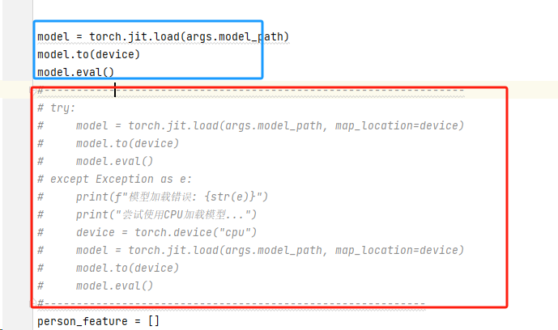

本文档是开发类文档，如需部署小智服务端，[点击这里查看部署教程](../README.md#%E4%BD%BF%E7%94%A8%E6%96%B9%E5%BC%8F-)

# 项目目录介绍
当你看到这份文件的时候，这个这个项目还没完善好。我们还有很多东西要做。

如果你会开发，我们非常欢迎您的加入。

```
xiaozhi-esp32-server
  ├─ xiaozhi-server 8000 端口 Python语言开发 负责与esp32通信
  ├─ manager-web 8001 端口 Node.js+Vue开发 负责提供控制台的web界面
  ├─ manager-api 8002 端口 Java语言开发 负责提供控制台的api
```

# xiaozhi-server 接口协议

[虾哥团队通信协议：Websocket 连接](https://ccnphfhqs21z.feishu.cn/wiki/M0XiwldO9iJwHikpXD5cEx71nKh)

# manager-web 、manager-api接口协议

[manager前后端接口协议](https://app.apifox.com/invite/project?token=H_8qhgfjUeaAL0wybghgU)

[前端页面设计图](https://codesign.qq.com/app/s/526108506410828)


# 1.运行指南

xiaozhi-server端的配置链接如下：

[xiaozhi-esp32-server/docs/Deployment.md at main · Icomi1/xiaozhi-esp32-server](https://github.com/Icomi1/xiaozhi-esp32-server/blob/main/docs/Deployment.md#模型文件)

[xiaozhi-esp32-server/docs/Deployment.md at main · Icomi1/xiaozhi-esp32-server](https://github.com/Icomi1/xiaozhi-esp32-server/blob/main/docs/Deployment.md#配置项目)


## 1.0按照小智文本的配置一样配置

```
conda remove -n xiaozhi-esp32-server --all -y
conda create -n xiaozhi-esp32-server python=3.10 -y
conda activate xiaozhi-esp32-server

# 添加清华源通道
conda config --add channels https://mirrors.tuna.tsinghua.edu.cn/anaconda/pkgs/main
conda config --add channels https://mirrors.tuna.tsinghua.edu.cn/anaconda/pkgs/free
conda config --add channels https://mirrors.tuna.tsinghua.edu.cn/anaconda/cloud/conda-forge

conda install libopus -y
conda install ffmpeg -y
```

进入到`main`文件夹，再进入到`xiaozhi-server`，好了请记住这个目录`xiaozhi-server`。

```bash
pip config set global.index-url https://mirrors.aliyun.com/pypi/simple/
pip install -r requirements.txt
```


## 1.2下载语音模型

百度网盘下载[SenseVoiceSmall](https://pan.baidu.com/share/init?surl=QlgM58FHhYv1tFnUT_A8Sg&pwd=qvna) 提取码: `qvna`

本项目语音识别模型，默认使用`SenseVoiceSmall`模型，进行语音转文字。因为模型较大，需要独立下载，下载后把`model.pt` 文件放在`models/SenseVoiceSmall` 目录下。下面两个下载路线任选一个。


## 1.3配置项目文件：


## 1.4运行到xiaozhi-server文件夹下运行

```bash
   pip install -r requirements.txt
```


## 1.5安装PyQt5

```bash
pip install PyQt5
```


## 1.3安装h5py

```
pip install h5py
```


# 2.常见问题

## 2.1安装PyAudio出现的编译问题

### 解决：

1. 安装 Visual C++ Build Tools

- 访问 https://visualstudio.microsoft.com/visual-cpp-build-tools/

- 下载并安装 "Microsoft C++ Build Tools"

- 安装时选择 "Desktop development with C++"

- 安装完成后，重新运行 pip install -r requirements.txt


#### 若编译也运行错误：

##### 若python为3.8

在下面这个链接下载

https://download.lfd.uci.edu/pythonlibs/archived/PyAudio-0.2.11-cp38-cp38-win_amd64.whl

然后进行安装

```
pip install PyAudio-0.2.11-cp38-cp38-win_amd64.whl
```


## 2.2CPU训练orGPU训练的问题

预训练模型是在 CUDA（GPU）版本的 PyTorch 上训练的，但我们安装的是 CPU 版本的 PyTorch

### 解决

卸载当前的 PyTorch：

```bash
pip uninstall torch torchvision torchaudio
```

安装GPU版本的Pytorch

```bash
pip install torch torchvision torchaudio --index-url https://download.pytorch.org/whl/cu118
```


如何切换CPUorGPU训练？

main/xiaozhi-server/infer_recognition.py



若要切换成CPU，则可以尝试将蓝色的代码注释掉，红色的代码取消注释
