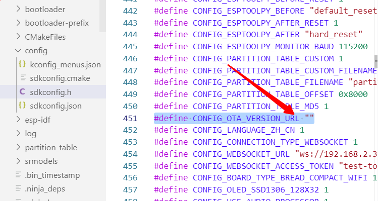
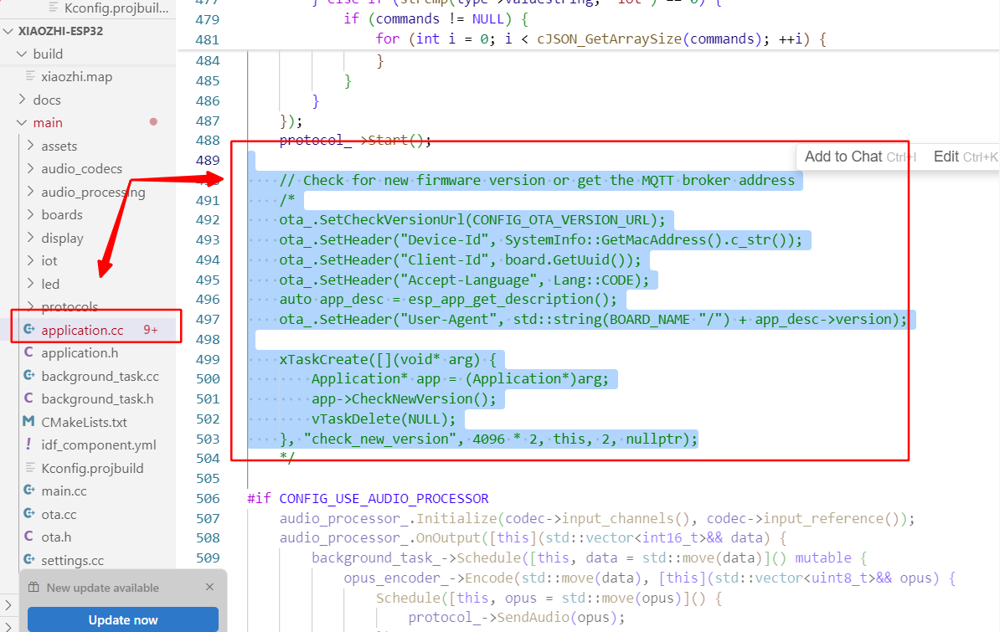

本文档是开发类文档，如需部署小智服务端，[点击这里查看部署教程](../README.md#%E4%BD%BF%E7%94%A8%E6%96%B9%E5%BC%8F-)

# 项目目录介绍
当你看到这份文件的时候，这个这个项目还没完善好。我们还有很多东西要做。

如果你会开发，我们非常欢迎您的加入。

```
xiaozhi-esp32-server
  ├─ xiaozhi-server 8000 端口 Python语言开发 负责与esp32通信
  ├─ manager-web 8001 端口 Node.js+Vue开发 负责提供控制台的web界面
  ├─ manager-api 8002 端口 Java语言开发 负责提供控制台的api
```

# xiaozhi-server 接口协议

[虾哥团队通信协议：Websocket 连接](https://ccnphfhqs21z.feishu.cn/wiki/M0XiwldO9iJwHikpXD5cEx71nKh)

# manager-web 、manager-api接口协议

[manager前后端接口协议](https://app.apifox.com/invite/project?token=H_8qhgfjUeaAL0wybghgU)

[前端页面设计图](https://codesign.qq.com/app/s/526108506410828)


# 1.xiaozhi-server运行指南

xiaozhi-server端的配置链接如下：

[xiaozhi-esp32-server/docs/Deployment.md at main · Icomi1/xiaozhi-esp32-server](https://github.com/Icomi1/xiaozhi-esp32-server/blob/main/docs/Deployment.md#模型文件)

[xiaozhi-esp32-server/docs/Deployment.md at main · Icomi1/xiaozhi-esp32-server](https://github.com/Icomi1/xiaozhi-esp32-server/blob/main/docs/Deployment.md#配置项目)


## 1.0按照小智文本的配置一样配置

```
conda remove -n xiaozhi-esp32-server --all -y
conda create -n xiaozhi-esp32-server python=3.10 -y
conda activate xiaozhi-esp32-server

# 添加清华源通道
conda config --add channels https://mirrors.tuna.tsinghua.edu.cn/anaconda/pkgs/main
conda config --add channels https://mirrors.tuna.tsinghua.edu.cn/anaconda/pkgs/free
conda config --add channels https://mirrors.tuna.tsinghua.edu.cn/anaconda/cloud/conda-forge

conda install libopus -y
conda install ffmpeg -y
```

进入到`main`文件夹，再进入到`xiaozhi-server`，好了请记住这个目录`xiaozhi-server`。

```bash
pip config set global.index-url https://mirrors.aliyun.com/pypi/simple/
pip install -r requirements.txt
```


## 1.2下载语音模型

百度网盘下载[SenseVoiceSmall](https://pan.baidu.com/share/init?surl=QlgM58FHhYv1tFnUT_A8Sg&pwd=qvna) 提取码: `qvna`

本项目语音识别模型，默认使用`SenseVoiceSmall`模型，进行语音转文字。因为模型较大，需要独立下载，下载后把`model.pt` 文件放在`models/SenseVoiceSmall` 目录下。下面两个下载路线任选一个。


## 1.3配置项目文件：


## 1.4运行到xiaozhi-server文件夹下运行

```bash
   pip install -r requirements.txt
```


## 1.5安装pyaudio

```
conda install pyaudio
```


## 1.5安装PyQt5

```bash
pip install PyQt5
```


## 1.3安装h5py

```
pip install h5py
```


# 2.xiaozhi-esp32端

## 2.1关闭自动OTA升级

检查新版本的流程

- 系统会向配置的OTA服务器（默认是 https://api.tenclass.net/xiaozhi/ota/）发送请求

- 请求中包含了设备信息（MAC地址、UUID、当前版本等）

- 如果服务器返回新版本信息，系统会自动开始升级

### step1：修改 Kconfig.projbuild 中的 CONFIG_OTA_VERSION_URL 配置：



### step2：注释掉代码




# 3.常见问题

## 3.1安装PyAudio出现的编译问题

### 解决：

1. 安装 Visual C++ Build Tools

- 访问 https://visualstudio.microsoft.com/visual-cpp-build-tools/

- 下载并安装 "Microsoft C++ Build Tools"

- 安装时选择 "Desktop development with C++"

- 安装完成后，重新运行 pip install -r requirements.txt


#### 若编译也运行错误：

##### 若python为3.8

在下面这个链接下载

https://download.lfd.uci.edu/pythonlibs/archived/PyAudio-0.2.11-cp38-cp38-win_amd64.whl

然后进行安装

```
pip install PyAudio-0.2.11-cp38-cp38-win_amd64.whl
```


## 3.2CPU训练orGPU训练的问题

预训练模型是在 CUDA（GPU）版本的 PyTorch 上训练的，但我们安装的是 CPU 版本的 PyTorch

### 解决

卸载当前的 PyTorch：

```bash
pip uninstall torch torchvision torchaudio
```

安装GPU版本的Pytorch

```bash
pip install torch torchvision torchaudio --index-url https://download.pytorch.org/whl/cu118
```


如何切换CPUorGPU训练？

main/xiaozhi-server/infer_recognition.py


若要切换成CPU，则可以尝试将蓝色的代码注释掉，红色的代码取消注释


## 3.3BLAS/LAPACK 库缺失的问题

```
  Installing build dependencies ... done
  Getting requirements to build wheel ... done
  Preparing metadata (pyproject.toml) ... error
  error: subprocess-exited-with-error

  × Preparing metadata (pyproject.toml) did not run successfully.
  │ exit code: 1
  ╰─> [149 lines of output]
      setup.py:461: UserWarning: Unrecognized setuptools command ('dist_info --egg-base C:\Users\90771\AppData\Local\Temp\pip-modern-metadata-8jsmrbsh'), proceeding with generating Cython sources and expanding templates
        warnings.warn("Unrecognized setuptools command ('{}'), proceeding with "
      setup.py:563: DeprecationWarning:

        `numpy.distutils` is deprecated since NumPy 1.23.0, as a result
        of the deprecation of `distutils` itself. It will be removed for
        Python >= 3.12. For older Python versions it will remain present.
        It is recommended to use `setuptools < 60.0` for those Python versions.
        For more details, see:
          https://numpy.org/devdocs/reference/distutils_status_migration.html


        from numpy.distutils.core import setup
      Running from SciPy source directory.
      INFO: lapack_opt_info:
      INFO: lapack_armpl_info:
      INFO: No module named 'numpy.distutils._msvccompiler' in numpy.distutils; trying from distutils
      INFO: customize MSVCCompiler
      INFO:   libraries armpl_lp64_mp not found in ['E:\\01Code\\anaconda3\\envs\\xiaozhivoice\\lib', 'C:\\', 'E:\\01Code\\anaconda3\\envs\\xiaozhivoice\\libs', 'E:\\01Code\\anaconda3\\Library\\lib']
      INFO:   NOT AVAILABLE
      INFO:
      INFO: lapack_mkl_info:
      INFO:   libraries mkl_rt not found in ['E:\\01Code\\anaconda3\\envs\\xiaozhivoice\\lib', 'C:\\', 'E:\\01Code\\anaconda3\\envs\\xiaozhivoice\\libs', 'E:\\01Code\\anaconda3\\Library\\lib']
      INFO:   NOT AVAILABLE
      INFO:
      INFO: lapack_ssl2_info:
      INFO:   libraries fjlapackexsve not found in ['E:\\01Code\\anaconda3\\envs\\xiaozhivoice\\lib', 'C:\\', 'E:\\01Code\\anaconda3\\envs\\xiaozhivoice\\libs', 'E:\\01Code\\anaconda3\\Library\\lib']
      INFO:   NOT AVAILABLE
      INFO:
      INFO: openblas_lapack_info:
      INFO:   libraries openblas not found in ['E:\\01Code\\anaconda3\\envs\\xiaozhivoice\\lib', 'C:\\', 'E:\\01Code\\anaconda3\\envs\\xiaozhivoice\\libs', 'E:\\01Code\\anaconda3\\Library\\lib']
      INFO: get_default_fcompiler: matching types: '['gnu', 'intelv', 'absoft', 'compaqv', 'intelev', 'gnu95', 'g95', 'intelvem', 'intelem', 'flang']'
      INFO: customize GnuFCompiler
      WARN: Could not locate executable g77
      WARN: Could not locate executable f77
      INFO: customize IntelVisualFCompiler
      WARN: Could not locate executable ifort
      WARN: Could not locate executable ifl
      INFO: customize AbsoftFCompiler
      WARN: Could not locate executable f90
      INFO: customize CompaqVisualFCompiler
      WARN: Could not locate executable DF
      INFO: customize IntelItaniumVisualFCompiler
      WARN: Could not locate executable efl
      INFO: customize Gnu95FCompiler
      WARN: Could not locate executable gfortran
      WARN: Could not locate executable f95
      INFO: customize G95FCompiler
      WARN: Could not locate executable g95
      INFO: customize IntelEM64VisualFCompiler
      INFO: customize IntelEM64TFCompiler
      WARN: Could not locate executable efort
      WARN: Could not locate executable efc
      INFO: customize PGroupFlangCompiler
      WARN: Could not locate executable flang
      WARN: don't know how to compile Fortran code on platform 'nt'
      INFO:   NOT AVAILABLE
      INFO:
      INFO: openblas_clapack_info:
      INFO:   libraries openblas,lapack not found in ['E:\\01Code\\anaconda3\\envs\\xiaozhivoice\\lib', 'C:\\', 'E:\\01Code\\anaconda3\\envs\\xiaozhivoice\\libs', 'E:\\01Code\\anaconda3\\Library\\lib']
      INFO:   NOT AVAILABLE
      INFO:
      INFO: flame_info:
      INFO:   libraries flame not found in ['E:\\01Code\\anaconda3\\envs\\xiaozhivoice\\lib', 'C:\\', 'E:\\01Code\\anaconda3\\envs\\xiaozhivoice\\libs', 'E:\\01Code\\anaconda3\\Library\\lib']
      INFO:   NOT AVAILABLE
      INFO:
      INFO: accelerate_info:
      INFO:   NOT AVAILABLE
      INFO:
      INFO: atlas_3_10_threads_info:
      INFO: Setting PTATLAS=ATLAS
      INFO:   libraries tatlas,tatlas not found in E:\01Code\anaconda3\envs\xiaozhivoice\lib
      INFO:   libraries tatlas,tatlas not found in C:\
      INFO:   libraries tatlas,tatlas not found in E:\01Code\anaconda3\envs\xiaozhivoice\libs
      INFO:   libraries tatlas,tatlas not found in E:\01Code\anaconda3\Library\lib
      INFO: <class 'numpy.distutils.system_info.atlas_3_10_threads_info'>
      INFO:   NOT AVAILABLE
      INFO:
      INFO: atlas_3_10_info:
      INFO:   libraries satlas,satlas not found in E:\01Code\anaconda3\envs\xiaozhivoice\lib
      INFO:   libraries satlas,satlas not found in C:\
      INFO:   libraries satlas,satlas not found in E:\01Code\anaconda3\envs\xiaozhivoice\libs
      INFO:   libraries satlas,satlas not found in E:\01Code\anaconda3\Library\lib
      INFO: <class 'numpy.distutils.system_info.atlas_3_10_info'>
      INFO:   NOT AVAILABLE
      INFO:
      INFO: atlas_threads_info:
      INFO: Setting PTATLAS=ATLAS
      INFO:   libraries ptf77blas,ptcblas,atlas not found in E:\01Code\anaconda3\envs\xiaozhivoice\lib
      INFO:   libraries ptf77blas,ptcblas,atlas not found in C:\
      INFO:   libraries ptf77blas,ptcblas,atlas not found in E:\01Code\anaconda3\envs\xiaozhivoice\libs
      INFO:   libraries ptf77blas,ptcblas,atlas not found in E:\01Code\anaconda3\Library\lib
      INFO: <class 'numpy.distutils.system_info.atlas_threads_info'>
      INFO:   NOT AVAILABLE
      INFO:
      INFO: atlas_info:
      INFO:   libraries f77blas,cblas,atlas not found in E:\01Code\anaconda3\envs\xiaozhivoice\lib
      INFO:   libraries f77blas,cblas,atlas not found in C:\
      INFO:   libraries f77blas,cblas,atlas not found in E:\01Code\anaconda3\envs\xiaozhivoice\libs
      INFO:   libraries f77blas,cblas,atlas not found in E:\01Code\anaconda3\Library\lib
      INFO: <class 'numpy.distutils.system_info.atlas_info'>
      INFO:   NOT AVAILABLE
      INFO:
      INFO: lapack_info:
      INFO:   libraries lapack not found in ['E:\\01Code\\anaconda3\\envs\\xiaozhivoice\\lib', 'C:\\', 'E:\\01Code\\anaconda3\\envs\\xiaozhivoice\\libs', 'E:\\01Code\\anaconda3\\Library\\lib']
      INFO:   NOT AVAILABLE
      INFO:
      C:\Users\90771\AppData\Local\Temp\pip-build-env-yvb52a4y\overlay\Lib\site-packages\numpy\distutils\system_info.py:1973: UserWarning:
          Lapack (http://www.netlib.org/lapack/) libraries not found.
          Directories to search for the libraries can be specified in the
          numpy/distutils/site.cfg file (section [lapack]) or by setting
          the LAPACK environment variable.
        return getattr(self, '_calc_info_{}'.format(name))()
      INFO: lapack_src_info:
      INFO:   NOT AVAILABLE
      INFO:
      C:\Users\90771\AppData\Local\Temp\pip-build-env-yvb52a4y\overlay\Lib\site-packages\numpy\distutils\system_info.py:1973: UserWarning:
          Lapack (http://www.netlib.org/lapack/) sources not found.
          Directories to search for the sources can be specified in the
          numpy/distutils/site.cfg file (section [lapack_src]) or by setting
          the LAPACK_SRC environment variable.
        return getattr(self, '_calc_info_{}'.format(name))()
      INFO:   NOT AVAILABLE
      INFO:
      Traceback (most recent call last):
        File "E:\01Code\anaconda3\envs\xiaozhivoice\lib\site-packages\pip\_vendor\pyproject_hooks\_in_process\_in_process.py", line 389, in <module>
          main()
        File "E:\01Code\anaconda3\envs\xiaozhivoice\lib\site-packages\pip\_vendor\pyproject_hooks\_in_process\_in_process.py", line 373, in main
          json_out["return_val"] = hook(**hook_input["kwargs"])
        File "E:\01Code\anaconda3\envs\xiaozhivoice\lib\site-packages\pip\_vendor\pyproject_hooks\_in_process\_in_process.py", line 175, in prepare_metadata_for_build_wheel
          return hook(metadata_directory, config_settings)
        File "C:\Users\90771\AppData\Local\Temp\pip-build-env-yvb52a4y\overlay\Lib\site-packages\setuptools\build_meta.py", line 161, in prepare_metadata_for_build_wheel
          self.run_setup()
        File "C:\Users\90771\AppData\Local\Temp\pip-build-env-yvb52a4y\overlay\Lib\site-packages\setuptools\build_meta.py", line 253, in run_setup
          super(_BuildMetaLegacyBackend,
        File "C:\Users\90771\AppData\Local\Temp\pip-build-env-yvb52a4y\overlay\Lib\site-packages\setuptools\build_meta.py", line 145, in run_setup
          exec(compile(code, __file__, 'exec'), locals())
        File "setup.py", line 588, in <module>
          setup_package()
        File "setup.py", line 584, in setup_package
          setup(**metadata)
        File "C:\Users\90771\AppData\Local\Temp\pip-build-env-yvb52a4y\overlay\Lib\site-packages\numpy\distutils\core.py", line 135, in setup
          config = configuration()
        File "setup.py", line 499, in configuration
          raise NotFoundError(msg)
      numpy.distutils.system_info.NotFoundError: No BLAS/LAPACK libraries found.
      To build Scipy from sources, BLAS & LAPACK libraries need to be installed.
      See site.cfg.example in the Scipy source directory and
      https://docs.scipy.org/doc/scipy/reference/building/index.html for details.
      [end of output]

  note: This error originates from a subprocess, and is likely not a problem with pip.
error: metadata-generation-failed

× Encountered error while generating package metadata.
╰─> See above for output.

```


### 解决

```
pip install --upgrade pip
pip install wheel setuptools
pip install numpy==1.24.3
pip install scipy==1.11.4
pip install -r requirements.txt --no-deps
```


## 3.4缺少pyaudio库

```
conda install pyaudio
```


## 3.5librosa升级

```
(xiaozhivoice) C:\code\test\xiaozhi-server-voice\main\xiaozhi-server>python app.py
Traceback (most recent call last):
  File "C:\code\test\xiaozhi-server-voice\main\xiaozhi-server\app.py", line 6, in <module>
    from core.providers.asr.fun_local import ASRProvider
  File "C:\code\test\xiaozhi-server-voice\main\xiaozhi-server\core\providers\asr\fun_local.py", line 11, in <module>
    from core.providers.voiceprint import recognition, register, args
  File "C:\code\test\xiaozhi-server-voice\main\xiaozhi-server\core\providers\voiceprint\__init__.py", line 5, in <module>
    from infer_recognition import register, recognition, load_audio_db, args
  File "C:\code\test\xiaozhi-server-voice\main\xiaozhi-server\infer_recognition.py", line 8, in <module>
    from utils.reader import load_audio
  File "C:\code\test\xiaozhi-server-voice\main\xiaozhi-server\utils\reader.py", line 1, in <module>
    import librosa
  File "E:\01Code\anaconda3\envs\xiaozhivoice\lib\site-packages\librosa\__init__.py", line 211, in <module>
    from . import core
  File "E:\01Code\anaconda3\envs\xiaozhivoice\lib\site-packages\librosa\core\__init__.py", line 9, in <module>
    from .constantq import *  # pylint: disable=wildcard-import
  File "E:\01Code\anaconda3\envs\xiaozhivoice\lib\site-packages\librosa\core\constantq.py", line 1059, in <module>
    dtype=np.complex,
  File "E:\01Code\anaconda3\envs\xiaozhivoice\lib\site-packages\numpy\__init__.py", line 305, in __getattr__
    raise AttributeError(__former_attrs__[attr])
AttributeError: module 'numpy' has no attribute 'complex'.
`np.complex` was a deprecated alias for the builtin `complex`. To avoid this error in existing code, use `complex` by itself. Doing this will not modify any behavior and is safe. If you specifically wanted the numpy scalar type, use `np.complex128` here.
The aliases was originally deprecated in NumPy 1.20; for more details and guidance see the original release note at:

```


### 解决

```
pip install --upgrade librosa
```


## 3.6Nonetype问题：funaser

```
2299714-509a-42e5-a92b-c43c68423e5c
25-03-27 14:33:08[infer_recognition] - INFO - 已加载用户音频: asr_ea6435a1-b34d-4875-b4c9-ebb9add77136_21bfec27-840a-4218-85c0-1dcd4a1584ac
25-03-27 14:33:08[infer_recognition] - INFO - 声纹数据库加载完成，共加载 49 个用户
25-03-27 14:33:14[core.providers.memory.memory] - INFO - 已加载记忆，当前用户: asr_99a0c393-bcdd-436d-8bb9-46f5bbcd5a12_74292ed5-d83a-45e3-98e1-06527d1159ae
25-03-27 14:33:14[core.providers.asr.fun_local] - INFO - funasr version: 1.2.3.
Traceback (most recent call last):
  File "C:\code\test\xiaozhi-server-voice\main\xiaozhi-server\app.py", line 16, in <module>
    asr_provider = ASRProvider(
  File "C:\code\test\xiaozhi-server-voice\main\xiaozhi-server\core\providers\asr\fun_local.py", line 48, in __init__
    self.model = AutoModel(
  File "E:\01Code\anaconda3\envs\example\lib\site-packages\funasr\auto\auto_model.py", line 125, in __init__
    model, kwargs = self.build_model(**kwargs)
  File "E:\01Code\anaconda3\envs\example\lib\site-packages\funasr\auto\auto_model.py", line 223, in build_model
    tokenizer = tokenizer_class(**tokenizer_conf)
TypeError: 'NoneType' object is not callable
```

解决

```
pip install --upgrade funasr
```

